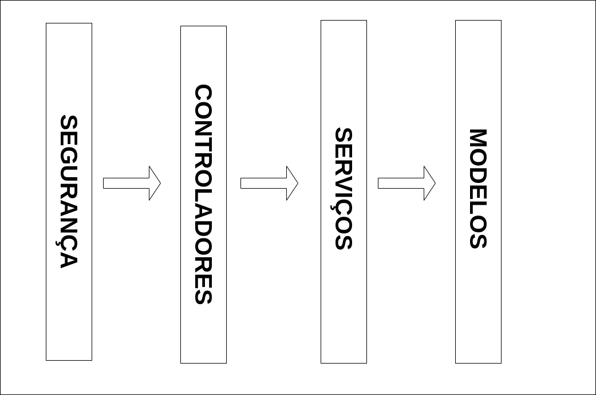

# Apresentação do Projeto

Esta API é um pequeno projeto para criação de cursos, usuários e matrículas de uma escola fictícia visando aprimorar e apresentar tecnicas de backend envolvendo padrões, segurança , gerenciamento de entidades e de banco de dados.

## Descrição Técnica

Esta API Restful foi criada usando NodeJS com NestJS e banco de dados usando PostgreSQL.

Baseada em modulos e camadas, o projeto foi pensado para um eventual crescimento e robustez , mas principalmente para organização do mesmo. 

A arquitetura modular, foi pensada justamente para que cada funcionalidade do sistema tivesse um módulo próprio, assim, fica mais conveniente disponibilizar ou não, recursos que estão em produção, ou quem sabe, mudar alguma arquitetura num futuro. Não somente isso, mas para promover o reuso de alguma funcionalidade em outros modulos.

A divisão por camadas, foi escolhida para manter os artefatos organizados de forma clara e objetiva de cada responsabilidade, como por exemplo os Controladores, que por serem a "ponta de lança", são os primeiros a serem chamados no fluxo de execução, servindo como interface inicial para conectar as requisições do usuário às camadas internas do sistema. 

Veja o esquema a seguir que representa o fluxo do projeto:



📚 Camadas
- Controllers (controllers)

>São os "maestros" que recebem as requisições e mandam os serviços fazerem o trabalho.
>Ex.: AuthController.ts, UserController.ts.

- Services (services)

>Onde mora a lógica de negócios.
>Fazem o trabalho pesado, tipo validações, cálculos ou regras específicas.
>Ex.: AuthService.ts, CourseService.ts.

- Models (models)

>Guarda tudo relacionado aos dados: DTOs, entidades e enums.
>Ex.: UserDTO.ts, Course.ts.

- Segurança (security)

>Estratégias de autenticação e coisas relacionadas a segurança.
>Ex.: JwtStrategy.ts.

- Utilitários (utils)

>Funções auxiliares pra evitar código repetido.
>Ex.: PasswordUtils.ts.

## Descrição Endpoints

### Welcome

```
GET
/api/welcome
```


### Users (Usuários)

```
POST
/api/users
Criar registro de usuário
```

```
GET
/api/users
Recuperar registros de usuário
```

```
GET
/api/users/{id}
Recuperar um registro de usuário pelo ID
```

```
PUT
/api/users/{id}
Atualizar registro de usuário pelo ID e Corpo com os atributos a serem atualizados
```

```
DELETE
/api/users/{id}
Remover registro de usuário pelo ID
```

### Courses (Cursos)

```
POST
/api/courses
Criar registro de curso
```

```
GET
/api/courses
Recuperar registros de curso
```

```
GET
/api/courses/{id}
Recuperar um registro de curso pelo ID
```

```
PUT
/api/courses/{id}
Atualizar registro de curso pelo ID e Corpo com os atributos a serem atualizados
```

```
DELETE
/api/courses/{id}
Remover registro de curso pelo ID
```

### Enrollments

```
POST
/api/enrollments
Criar registro de matrícula
```

```
GET
/api/enrollments
Recuperar registros de matrícula
```

```
GET
/api/enrollments/{id}
Recuperar um registro de matrícula pelo ID
```

```
PUT
/api/enrollments/{id}
Atualizar registro de matrícula pelo ID e Corpo com os atributos a serem atualizados
```

```
DELETE
/api/enrollments/{id}
Remover registro de matrícula pelo ID
```

```
GET
/api/enrollments/users/{id}
Recuperar registros de matrícula pelo ID do Usuário
```

### Auth (Autenticação)

```
POST
/api/auth/login
Realizar login
```

## Execução Localmente

Para a execução da API localmente, precisamos de alguns detalhes importantes que irei mencionar a seguir:

1. Ter o Node instalado.
> Se não tiver o Node nem o NPM instalado, é impressindível que tenha. Pois é com o Node que o projeto será executado. Para instalar, basta instalar a versão mais nova do Node e do NPM. Ou se preferir, instale o NVM (Node Version Manager - Gerenciador de Versão do Node) somente com um executável no Windows ou `sudo apt install nvm -y` no linux.

2. Ter o Docker instalado.
> Docker irá servir como o banco de dados local, para não ter a necessidade de um Postgres instalado localmente. Esse passo é opcional, caso ja tenha um banco de dados instalado localmente, ou ter algum servidor rodando, desconsidere esse requisito.

### Comandos para instalação

Primeiro precisamos subir o docker para conectar ao banco de dados posteriormente.

```bash
docker-compose up -d
```

Depois precisamos instalar as dependências

```bash
npm install
```

Agora, só precisamos rodar o projeto 

```bash
npm run dev
```

Para mais informações, acesse:

http://localhost:3000/api

ou

https://oluap-courses-svc-backend.onrender.com/api

para acessar o Swagger


# Conclusão

Essa API foi bastante enriquecedora para implementar, pois tem um pouco de tudo, CRUDs , Segurança, Implementação de Padrões, Documentação e principalmente , Escalabilidade.

Para saber mais informações ou querer colaborar para uma ideia maior, mande um email para:

pauloaguiar.developer@gmail.com